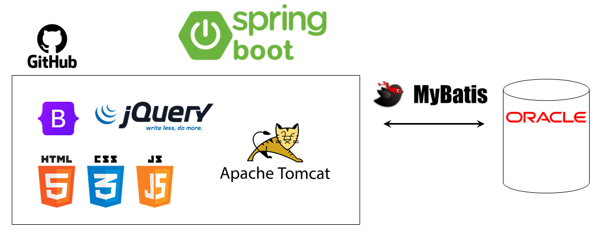
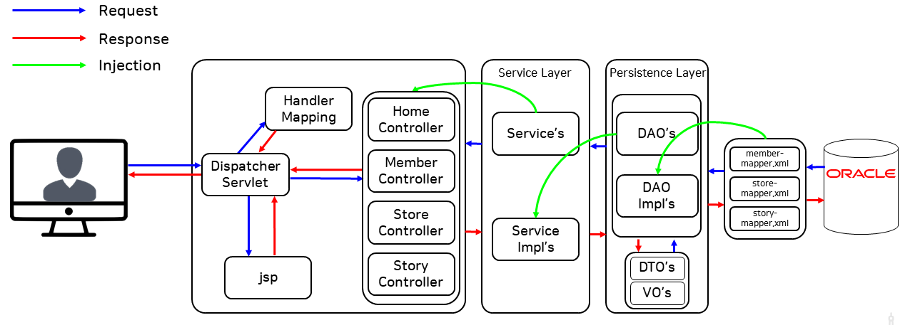
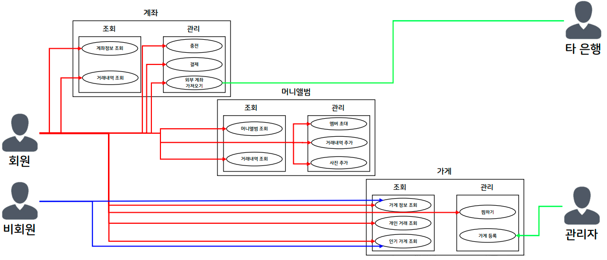
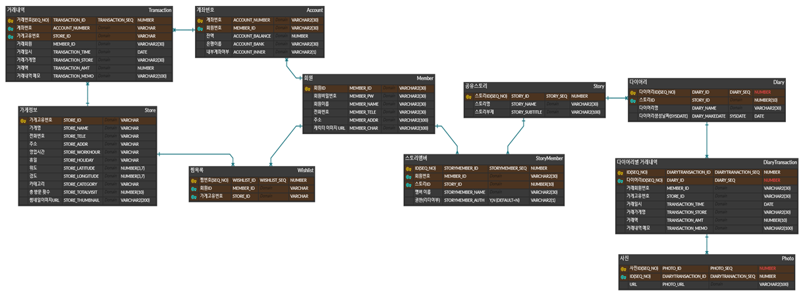
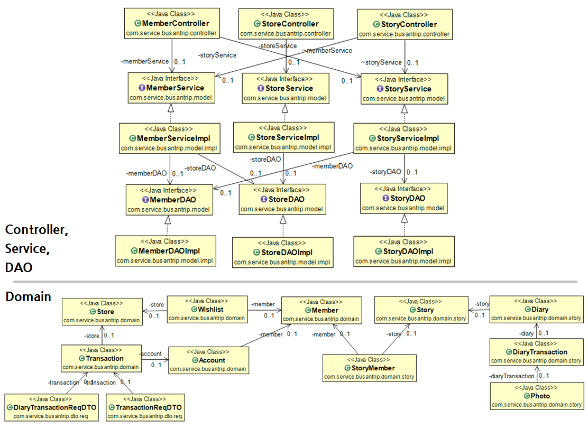
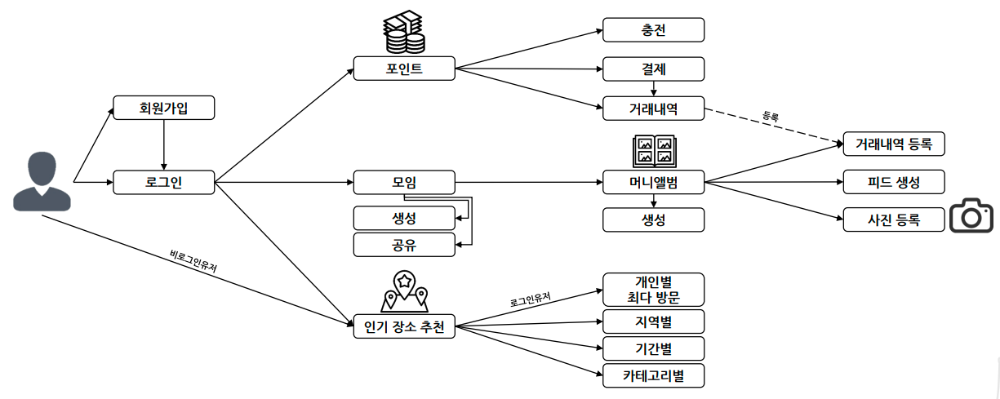

# 2022 BNK부산은행 D-IT Tech-Internship 1기 프로젝트

## 목차

- 1. [프로젝트 개요](#1-프로젝트-개요)
    - 1-1. [프로젝트 발표 자료](#1-1-프로젝트-발표-자료)
    - 1-2. [프로젝트 목적](#1-2-프로젝트-목적)
- 2. [프로젝트 구조](#2-프로젝트-구조)
    - 2-1. [시스템 아키텍쳐](#2-1-시스템-아키텍쳐)
    - 2-2. [유스케이스 다이어그램 & ERD](#2-2-유스케이스-다이어그램--erd)
    - 2-3. [클래스 다이어그램](#2-3-클래스-다이어그램)
    - 2-4. [Workflow](#2-4-workflow)
- 3. [프로젝트 정보](#3-프로젝트-정보)
    - 3-1. [팀 및 서비스 이름](#3-1-팀-및-서비스-이름)
    - 3-2. [프로젝트 구성원](#3-2-프로젝트-구성원)
    - 3-3. [프로젝트 기간](#3-3-프로젝트-기간)
    - 3-4. [프로젝트 환경](#3-4-프로젝트-환경)
    - 3-5. [발전 가능성 및 보완점](#3-5-발전-가능성-및-보완점)

***

# 여행가실부은✈️

🛠 [Github link↗](https://github.com/ssy0061/MyBusanTripInfo)

## 1. 프로젝트 개요

### 1-1. 프로젝트 발표 자료
1차: [여행가실부은 발표자료](./docImage/MBTIppt.pptx)
2차: [여행가실부은 발표자료2](./docImage/MBTIppt2.pptx)

### 1-2. 프로젝트 목적
기존의 모임관리 및 모임통장 서비스는 모임 활동을 위해 무조건 한 개 이상의 별도 모임 계좌를 만들어야 합니다. 또한, 소비 내역을 토대로 사진을 업로드하는 플랫폼은 업로드 시 직접 영수증을 촬영해서 인증해야 하고 원치 않는 거래 내역도 공유해야 하는 단점이 있습니다.

따라서, 거래 내역을 기반으로 모임 계좌 없이 기존 거래 내역으로 만드는 **머니앨범**을 제공하고, 나아가 거래 내역 기반 **핫플레이스**를 다양한 범주에서 추천해 주는, MZ 세대의 새로운 소비 기록 플랫폼인 **여행가실부은**을 만들게 되었습니다.

## 2. 프로젝트 구조

### 2-1. 시스템 아키텍쳐

### 2-2. 유스케이스 다이어그램 & ERD

### 2-3. 클래스 다이어그램

### 2-4. Workflow

## 3. 프로젝트 정보

### 3-1. 팀 및 서비스 이름
- **팀 이름**: MBTI(My Busan Trip Info)
- **서비스 이름**: 여행가실부은

### 3-2. 프로젝트 구성원
- **Front-end**
    - **서상용** [(Github)](https://github.com/ssy0061)
    - **장연정** [(Github)](https://github.com/yjungs2)
    - **허수민** [(Github)](https://github.com/acetyl-CoA)

- **Back-end**
    - **곽효석** [(Github)](https://github.com/kkhsuk)
    - **조서영** [(Github)](https://github.com/choseoyeong)

### 3-3. 프로젝트 기간
- **1차 프로젝트 제작 기간**: 2022. 08. 10. ~ 2022. 09. 08.
- **2차 프로젝트 제작 기간**: 2022. 09. 19. ~ 2022. 09. 28.

### 3-4. 프로젝트 환경
- **개발 환경**: Window 10, JDK 1.8, Oracle 11.2.0.2, Tomcat 8.5
- **주요 개발 언어 및 도구**: HTML, CSS, Javascript, Java, Oracle DBMS, MyBatis, Spring Boot
- **형상 관리**: Github

### 3-5. 발전 가능성 및 보완점
- **발전 가능성**:
    - 마이데이터 및 추천 알고리즘과 접목한 서비스 연동 가능
    - 핫플레이스의 카테고리 세분화를 토대로 다양한 정보 제공 가능
    - 지역화폐와 연계하여 지역경제 활성화 도모 가능
    - 부산이라는 지역을 넘어서 타 지역으로 서비스 확장 가능
- **보완점**:
    - 모임 정산 서비스, 모임 채팅 기능
    - 지출에 관한 별도 분석
    - 사진 대신 영상 업로드 후 보여주는 기능

***